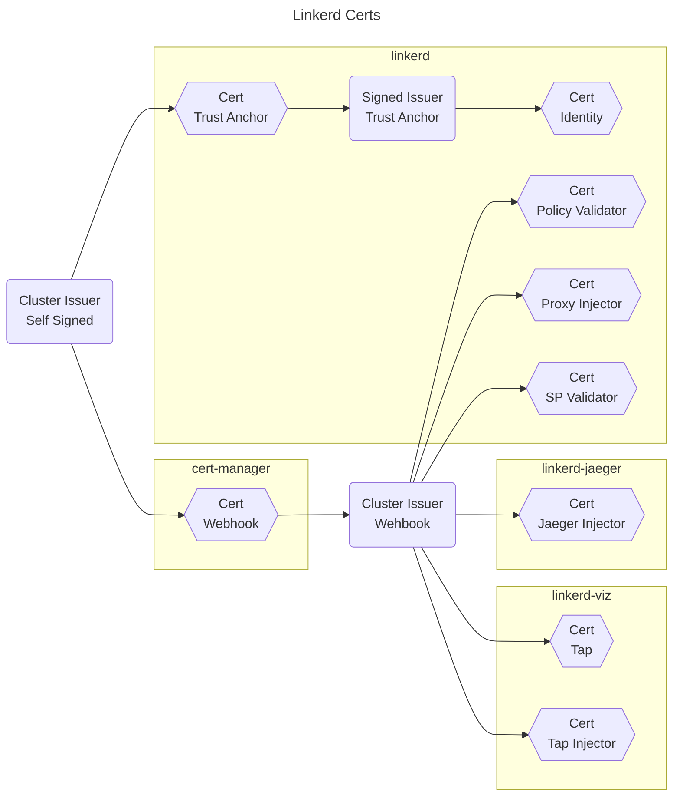

# Linkerd Certs

```mermaid
---
title: Linkerd Certs
---
graph LR
    ci_ss(Cluster Issuer</br>Self Signed)
    ci_wh(Cluster Issuer</br>Wehbook)

    subgraph cert-manager
        c_wh{{Cert</br>Webhook}}
    end

    subgraph linkerd
        c_ta{{Cert</br>Trust Anchor}}
        si_ta(Signed Issuer</br>Trust Anchor)
        c_id{{Cert</br>Identity}}

        c_pv{{Cert</br>Policy Validator}}
        c_pi{{Cert</br>Proxy Injector}}
        c_spv{{Cert</br>SP Validator}}
    end

    subgraph linkerd-viz
        c_vt{{Cert</br>Tap}}
        c_vti{{Cert</br>Tap Injector}}
    end

    subgraph linkerd-jaeger
        c_ji{{Cert</br>Jaeger Injector}}
    end

    ci_ss --> c_ta
    ci_ss --> c_wh
    
    c_wh --> ci_wh
    c_ta --> si_ta

    si_ta --> c_id
    ci_wh --> c_pv
    ci_wh --> c_pi
    ci_wh --> c_spv
    ci_wh --> c_vt
    ci_wh --> c_vti
    ci_wh --> c_ji
```
